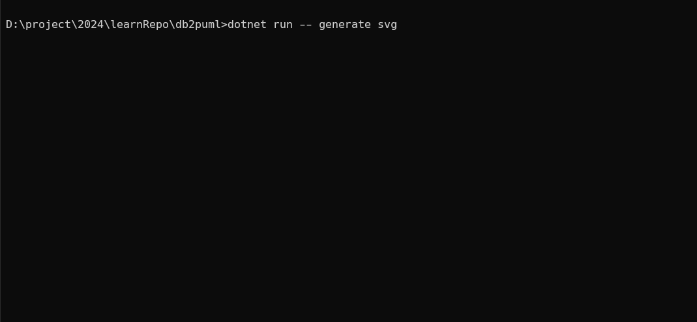

 
<p align="right">
  <a href="">
    
  </a>
  <a href="">
    
  </a>
  <a href="">
    
  </a>
  <a href="https://github.com/ahsanu123/db2puml">
    
  </a>
</p>

<p align="center">  
   
</p>

<h3 align="center">✨ Toy Project To Generate Database Server Entity Diagram </h3>


## 🎏 DB2PUML
Generate PlantUML Entity Relationship Diagram From Database Tables

This command line utility parses the tables in Database server to generate PlantUML syntax to create diagrams of Databse tables and thier foreign key relationships 

## 🧰 Prerequisite
- Dotnet 8 for build
- Java for running plantuml
- Graphviz 
- PlantUML.jar (auto downloaded if not found)
 
## 🗒️ Example Usage 
after build, change Connection string in `setting.json`, then you can try to generate svg with 
```shell
dotnet run -- generate svg 
```
you can see example svg/puml output in [documentation](https://github.com/ahsanu123/db2puml/tree/main/db2puml/output)

## ⛑️ Help Command 
```shell
╔════════════════════════════════════════════════════════════════╗
║                                                                ║
║   ██████  ██████  ██████  ██████  ██    ██ ███    ███ ██       ║
║   ██   ██ ██   ██      ██ ██   ██ ██    ██ ████  ████ ██       ║
║   ██   ██ ██████   █████  ██████  ██    ██ ██ ████ ██ ██       ║
║   ██   ██ ██   ██ ██      ██      ██    ██ ██  ██  ██ ██       ║
║   ██████  ██████  ███████ ██       ██████  ██      ██ ███████  ║
║                                                                ║
╚════════════════════════════════════════════════════════════════╝
USAGE:
    db2puml.dll [OPTIONS] <COMMAND>

EXAMPLES:
    db2puml.dll list
    db2puml.dll generate svg --name mysvg
    db2puml.dll generate svg --name mysvg --output svg_output_folder
    db2puml.dll generate pdf --name mydiagrampdf
    db2puml.dll generate pdf --name mydiagrampdf --output myCustomOutputFolder

OPTIONS:
    -h, --help       Prints help information
    -v, --version    Prints version information

COMMANDS:
    config
    generate

```

## 🥝 Note

- TODO: add support to postgres, mysql, sqlite
- TODO: Create `setting.json` setup ui
- if you use cmd or windows based terminal emoji may not showing up, you can use `chcp 65001 & cmd` to see emoji (ref: https://conemu.github.io/en/UnicodeSupport.html)
- this project forked from https://github.com/OceanAirdrop/SqlServerToPlantUML.git

